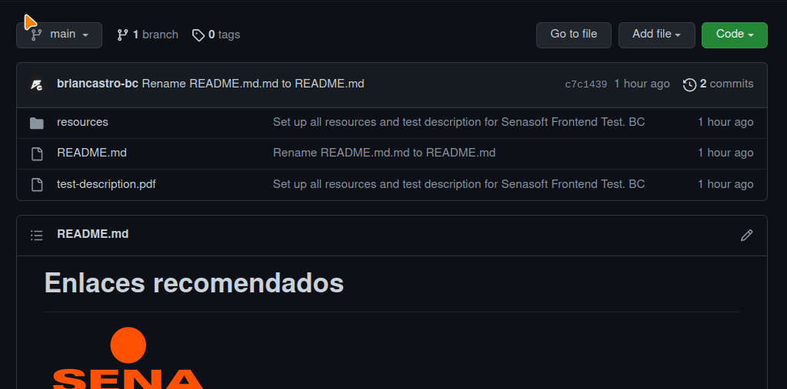

# Enlaces recomendados

Te entregamos la recopilación de los siguientes enlaces con las herramientas que
podrían ser de ayuda para tí en el desarrollo de la prueba.

## ¿Cómo descargar los recursos?

Te presentamos un pequeño video demostrativo de cómo descargar los recursos

## Librería de íconos

-   **Flaticons:** https://www.flaticon.es/uicons
-   **Iconscout:** https://iconscout.com/unicons/explore/line
-   **Boxicons:** https://boxicons.com/
-   **Fontawesome:** https://fontawesome.com/icons
-   **Iconmoon:** https://icomoon.io/#icons

## Programas de maquetado y edición en linea

-   **Figma:** https://www.figma.com/
-   **Photophea:** https://www.photopea.com/
-   **Draw.io:** https://app.diagrams.net/
-   **Lucidchart:** https://www.lucidchart.com/pages/es

Te deseamos toda la suerte de este mundo en este proceso.
Esperamos que lo des todo por el desarrollo.
